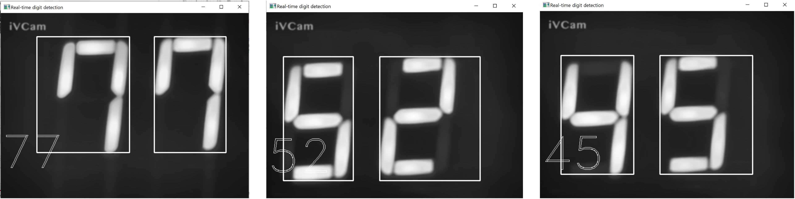

## AIIoT-makerthon-7segmentdigit-classification

: 2022 AI+IoT 메이커톤 대회 
: 세탁기 남은시간 7세그먼트 숫자 탐지 

[example]

[codes]
- main detection 코드 : 7seg_digit_detection.py
- dataset augment + preprocess 코드 : dataset_process.ipynb 
- cnn train 코드 : train_cnn_vgg16.ipynb
- 아두이노 7세그먼트 디스플레이 코드 : arduino/*.ino 

[dataset, model files]
- release에 첨부

[reference]
- digit location detect : https://github.com/jiweibo/SSOCR/blob/master/ssocr.py 

